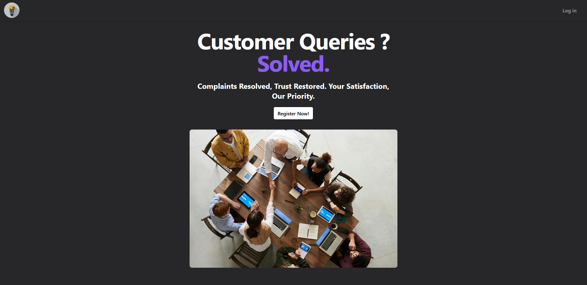

## Customer Relationship Management (CRM) Software

Visit Here - **[CRM](https://crm-app-ui.vercel.app/)**

### Introduction

CRM (Customer Relationship Management) Software is an platform where Customers can register their issues regarding any problems they are facing. It is an open-source project where enthusiastic developers can contribute.

## Features

- Registration
- Login
- Dashboard
- Profile
- Tickets
- Create Ticket
- Update Ticket
- Assign Engineer
- Close Ticket
- Change Password

### Technologies used

- [React](https://reactjs.org/)
- [Redux](https://redux.js.org/)
- [React Toolkit](https://redux-toolkit.js.org/)
- [React Hook Form](https://react-hook-form.com/)
- [Tailwind CSS](https://tailwindcss.com/)
- [React-Router-Dom](https://reactrouter.com/)
- [React-Hot-Toast](https://www.npmjs.com/package/react-hot-toast)
- [Vite](https://vitejs.dev/)
- [Node.js](https://nodejs.org/en/)
- [Express.js](https://expressjs.com/)
- [Prettier](https://prettier.io/)
- [ESLint](https://eslint.org/)
- [React Icons](https://react-icons.github.io/react-icons/)
- [Lucide React](https://lucide.dev/)
- [Material UI](https://mui.com/)
- [Axios](https://axios-http.com/) and many more...
