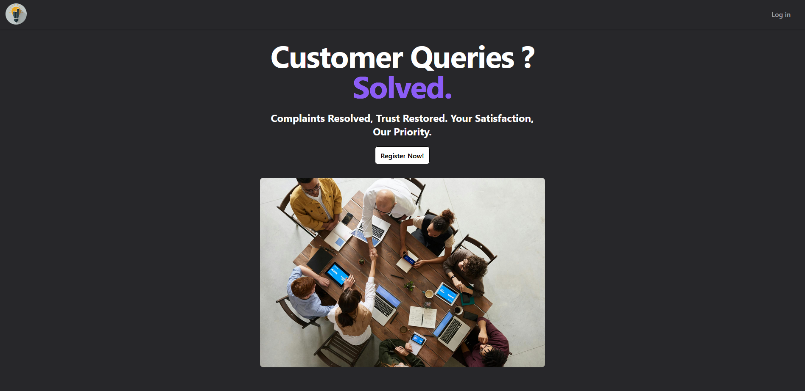

# Customer Relationship Management (CRM) Software

[**Visit CRM Live Demo**](https://crm-app-ui.vercel.app/)

---

## Introduction

Welcome to the **Customer Relationship Management (CRM) Software**, a robust platform designed to help customers register and manage issues they encounter. This is an open-source project, inviting enthusiastic developers to contribute and enhance its capabilities.

---

## Features

Streamline customer support with the following powerful features:

- **Registration**: Easy sign-up for new users.
- **Login**: Secure access to the platform.
- **Dashboard**: Centralized view of all activities.
- **Profile**: Manage personal user information.
- **Tickets**: Track and monitor customer issues.
- **Create Ticket**: Submit new support requests.
- **Update Ticket**: Modify existing ticket details.
- **Assign Engineer**: Allocate tickets to support staff.
- **Close Ticket**: Resolve and archive completed issues.
- **Change Password**: Update account security settings.

---

## Technologies Used

Built with a modern tech stack for performance and scalability:

### Frontend
- **[React](https://reactjs.org/)**: Dynamic UI components.
- **[Redux](https://redux.js.org/)**: State management.
- **[React Toolkit](https://redux-toolkit.js.org/)**: Simplified Redux setup.
- **[React Hook Form](https://react-hook-form.com/)**: Efficient form handling.
- **[Tailwind CSS](https://tailwindcss.com/)**: Utility-first styling.
- **[React-Router-Dom](https://reactrouter.com/)**: Seamless navigation.
- **[React-Hot-Toast](https://www.npmjs.com/package/react-hot-toast)**: Elegant notifications.
- **[Material UI](https://mui.com/)**: Pre-built UI components.
- **[React Icons](https://react-icons.github.io/react-icons/)**: Icon library.
- **[Lucide React](https://lucide.dev/)**: Lightweight icons.

### Build Tools
- **[Vite](https://vitejs.dev/)**: Fast development and build tool.

### Backend
- **[Node.js](https://nodejs.org/en/)**: JavaScript runtime.
- **[Express.js](https://expressjs.com/)**: Web framework.
- **[Axios](https://axios-http.com/)**: HTTP client for API requests.

### Code Quality
- **[Prettier](https://prettier.io/)**: Code formatting.
- **[ESLint](https://eslint.org/)**: Code linting.

...and many more!

---

## Getting Started

Interested in contributing or setting up the project locally? Follow these steps:

1. **Clone the repository**: `git clone <repository-url>`
2. **Install dependencies**: `npm install`
3. **Run the development server**: `npm run dev`
4. Explore the app at `http://localhost:3001`

---

## Contributing

We welcome contributions! Please check out our [Contributing Guidelines](#) (to be added) for more details on how to get involved.

---

## License

This project is open-source and available under the [MIT License](#) (to be specified).